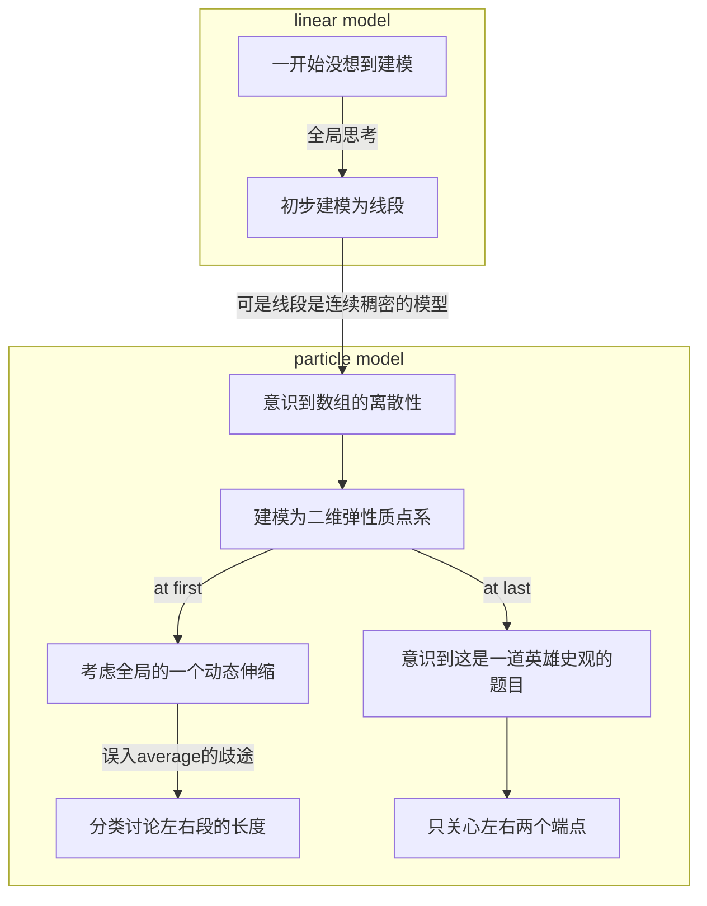

# LeetCode Climbing


## solution manual

### 0001-0099


#### [9. 回文数](https://leetcode.cn/problems/palindrome-number/)

##### 题目

给你一个整数`x` ，如果`x`是一个回文整数，返回`true`；否则，返回`false`。

回文数是指正序（从左向右）和倒序（从右向左）读都是一样的整数。

例如，`121` 是回文，而 `123` 不是。

__示例 1：__

```
输入：x = 121
输出：true
```


__示例 2：__

```
输入：x = -121
输出：false
解释：从左向右读, 为 -121 。 从右向左读, 为 121- 。因此它不是一个回文数。
```

__示例 3：__

```
输入：x = 10
输出：false
解释：从右向左读, 为 01 。因此它不是一个回文数。
```


__提示：__

$$
-2^{31} <= x <= 2^{31} - 1
$$
__进阶：__你能不将整数转为字符串来解决这个问题吗？


##### 题解

按照示例的意思：

1. 所有的负数都不能算回文数
2. 回文操作后首位的0仍然作数


> 进阶要求我不将整数转为字符串来解决问题，我恰好还不乐意转变为字符串
>
> > 主要是因为有遗忘（羞


```c
bool isPalindrome(int x){
    int n=x,w=0,a[32],i;
    bool ju;
    if (x<0) {
        ju=false;
        exit(ju);
    }
    else {
        while (n) {
            n/=10;
            w++;
        }
        n=x;
        for (i=0;i<w;i++) {
            a[i]=n/pow(10,w-i);//顺序存储
            n-=a[i]*pow(10,w-i);
        }
        for (i=0;i<w-1-i;i++) {
            if (a[i]!=a[w-1-i]) {
                ju=false;
                break;
            }else {
                ju=true;
            }
        }
        return ju;
    } 
}
```

竟然连121都能判断错！它明明就是回文数！

我要在CLion里康康：

```c
#include <stdio.h>
#include <math.h>
#include <stdbool.h>
bool isPalindrome(int x){
    int n=x,w=0,a[32],i;
    bool ju;
    if (x<0) {
        ju=false;
        exit(ju);
    }
    else {
        while (n) {
            n/=10;
            w++;
        }
        n=x;
        for (i=0;i<w;i++) {
            a[i]=n/pow(10,w-i);//顺序存储
            n-=a[i]*pow(10,w-i);
        }
        for (i=0;i<w-1-i;i++) {
            if (a[i]!=a[w-1-i]) {
                ju=false;
                break;
            }else {
                ju=true;
            }
        }
        return ju;
    }
}
int main()
{
    int x;
    scanf("%d",&x);
    printf("%d",isPalindrome(x));
    return 0;
}
```

###### `bool`类型需要的头文件和万能头文件初探

起初没有加`#include <stdbool.h>`，就会报错`Unknown type name 'bool'`

干脆使用万能头文件`#include <bits/stdc++.h>`

> [(12条消息) C/C++头文件太难记？一个万能头文件全搞定！_Estrellas_的博客-CSDN博客_万能头文件](https://blog.csdn.net/OpenStack_/article/details/88357296)

但是我的CLion反而报错`'bits/stdc++.h' file not found`了。难道是我的MacBook有什么东西没有安装吗？

> 果然如此。我的电脑没配置。
>
> 好在大多数OJ都支持万能头文件。
>
> [(12条消息) macOS 下 CLion 使用 bits/stdc++.h 头文件_LucienShui的博客-CSDN博客](https://blog.csdn.net/xs18952904/article/details/78167695)

先不管配置万能头文件，我现在还比较菜，多记一些常识性的头文件很重要。


###### exit的正确使用

我在`if`语句里使用了`exit`，这其实不必要，因为`if`和`else`又不会同时执行～。

CLion报错`Implicitly declaring library function 'exit' with type 'void (int) __attribute__((noreturn))'`

此外，我对`exit` 的使用限制的理解也是错误的。

> [C语言中的exit()函数 - wind-zhou - 博客园 (cnblogs.com)](https://www.cnblogs.com/wind-zhou/p/12869612.html)
>
> - exit(1)表示异常退出.这个1是返回给操作系统的。
> - exit(x)（x不为0）都表示异常退出
>   - 所以说我退出ju这个变量也是异常退出
> - exit(0)表示正常退出
> - exit()的参数会被传递给一些操作系统，包括UNIX,Linux,和MS DOS，以供其他程序使用。

不过，异常退出并不会导致CLion报错，真正的原因还是我不知道exit要搭配头文件`#include <stdlib.h>`

最好还是换回return：

```c
#include <stdio.h>
#include <math.h>
#include <stdbool.h>
#include <stdlib.h>
bool isPalindrome(int x){
    int n=x,w=0,a[32],i;
    bool ju;
    if (x<0) {
        ju=false;
        return ju;
    }
    else {
        while (n) {
            n/=10;
            w++;
        }
        n=x;
        for (i=0;i<w;i++) {
            a[i]=n/pow(10,w-i);//顺序存储
            n-=a[i]*pow(10,w-i);
        }
        for (i=0;i<w-1-i;i++) {
            if (a[i]!=a[w-1-i]) {
                ju=false;
                break;
            }else {
                ju=true;
            }
        }
        return ju;
    }
}
int main()
{
    int x;
    scanf("%d",&x);
    printf("%d",isPalindrome(x));
    return 0;
}
```

###### 顺序存储常见失误

可是仍然不能正确判断回文数。

调试后发现`a[0]`竟然存储着0。

原来是因为这段：

```c
for (i=0;i<w;i++) {
    a[i]=n/pow(10,w-i);//顺序存储
    n-=a[i]*pow(10,w-i);
}
```

$$
取首位数的时候，除以10^{位数}只会得到0\\例如121/10^3=121/1000=0
$$

这是典型错误。


最终代码如下：

```c
#include <stdio.h>
#include <math.h>
#include <stdbool.h>
bool isPalindrome(int x){
    int n=x,w=0,a[32],i;
    bool ju;
    if (x<0) {
        ju=false;
        return ju;
    }
    else {
        while (n) {
            n/=10;
            w++;
        }
        n=x;
        for (i=0;i<w;i++) {
            a[i]=n/pow(10,w-1-i);//顺序存储
            n-=a[i]*pow(10,w-1-i);
        }
        for (i=0;i<w-1-i;i++) {
            if (a[i]!=a[w-1-i]) {
                ju=false;
                break;
            }else {
                ju=true;
            }
        }
        return ju;
    }
}
int main()
{
    int x;
    scanf("%d",&x);
    printf("%d",isPalindrome(x));
    return 0;
}
```


##### 优化

> 执行用时：12 ms, 在所有 C 提交中击败了43.77%的用户
>
> 内存消耗：6.1 MB, 在所有 C 提交中击败了6.49%的用户
>
> 通过测试用例：11510 / 11510
>
> [回文数 - 提交记录 - 力扣（LeetCode）](https://leetcode.cn/submissions/detail/339426049/)

内存消耗击败6.49%的人不代表我消耗的内存小，而是指我消耗的内存大，空间复杂度大。

###### Stage1. 减少数组元素数量

$$
我定义int\ a[32]真没必要\\因为x_{max}=2^{31}-1=2147483648-1=2147483647
$$

所以只需要`int a[10]`

> 执行用时：16 ms, 在所有 C 提交中击败了20.22%的用户
>
> 内存消耗：5.9 MB, 在所有 C 提交中击败了35.51%的用户
>
> 通过测试用例：11510 / 11510

内存消耗是减少了0.2MB，确实不少，但是诡异的事情发生了，为什么执行用时增加了？难道是偶然因素？

再执行一次：

> 执行用时：20 ms, 在所有 C 提交中击败了6.76%的用户
>
> 内存消耗：6 MB, 在所有 C 提交中击败了7.66%的用户
>
> 通过测试用例：11510 / 11510

执行用时和内存消耗双双增加，太诡异了！真的是电脑问题（恼

>执行用时：16 ms, 在所有 C 提交中击败了20.22%的用户
>
>内存消耗：6.1 MB, 在所有 C 提交中击败了7.35%的用户
>
>通过测试用例：11510 / 11510

看来每次运行的时间和内存都是不稳定的，给我整量子力学是吧（恼

> 执行用时：8 ms, 在所有 C 提交中击败了73.44%的用户
>
> 内存消耗：6 MB, 在所有 C 提交中击败了8.09%的用户
>
> 通过测试用例：11510 / 11510

喔😯吼吼，执行用时突然变成8ms！难道说leetcode是线上平台所以受网速影响比较大嘛？


### 0100-0199


### 0200-0299


### 0300-0399


### 0400-0499


### 0500-0599


### 0600-0699


### 0700~0799


### 0800~0899


### 0900~0999


#### [908. 最小差值 I](https://leetcode-cn.com/problems/smallest-range-i/)

##### 题目

给你一个整数数组`nums`，和一个整数 `k` 。

在一个操作中，您可以选择 `0 <= i < nums.length` 的任何索引 `i` 。将 `nums[i]` 改为 `nums[i] + x` ，其中 `x` 是一个范围为 `[-k, k]` 的整数。对于每个索引 `i` ，最多 **只能** 应用 **一次** 此操作。

`nums` 的 **分数** 是 `nums` 中最大和最小元素的差值。 

在对  `nums` 中的每个索引最多应用一次上述操作后，返回 `nums` 的最低 **分数** 。

 

示例 1：

```
输入：num = [1], k = 0
输出：0
解释：分数是 max(nums) - min(nums) = 1 - 1 = 0。
```

示例 2：

```
输入：nums = [0,10], k = 2
输出：6
解释：将 nums 改为 [2,8]。分数是 max(nums) - min(nums) = 8 - 2 = 6。
```

示例 3：

```
输入：nums = [1,3,6], k = 3
输出：0
解释：将 nums 改为 [4,4,4]。分数是 max(nums) - min(nums) = 4 - 4 = 0。
```


提示：

* `1 <= nums.length <= 104`
* `0 <= nums[i] <= 104`
* `0 <= k <= 104`


##### 题解

> `2022-4-30`
>
> 　　这是我第一次认真刷leetcode上面的算法题，此前已经想在线上环境做算法题很久了，今天开始做发现一点不适，所以决定写这本**LeetCode Climbing**.
>
> 1. 线上环境的笔记功能不足
>    1. leetcode自带的线上笔记小窗口太小，功能不如typora齐全，满足不了我的演草需求
>       1. 不能实时预览效果
>       2. 用不了mermaid画图
>       3. 很多普通语法功能实现起来都怪怪的，例如**加粗**，*斜体*
>    2. leetcode即便打开了笔记大窗口，也不能实时预览，照样影响我的演草
>    3. leetcode的笔记保存方式不够好，笔记一旦多起来就很乱
>       1. 没有大提纲、小提纲之分
> 2. GitHub用起来麻烦
>    1. 以我目前的水平，还体会不到GitHub对我来说有什么必要，况且我也不担心本地文件会丢失
>    2. 在typora上直接用markdown写题解很痛苦，功能简直比leetcode还差
>       1. 所以就算我担心本地文件会丢失，我也只会把我在typora上写好的东西传到GitHub上，不会直接在GitHub上写
>
> 我打算以后每周至少写三题吧，毕竟目前C语言还有结构体和文件没学，指针和字符串也只是浅浅地学了，还要系统地在蓝桥云课上学数据结构与算法，所以不能把大量精力花在leetcode的刷题上。现阶段的leetcode刷题仅仅是为了开拓眼界。
>
> 还有一点必须交代，这本书不可能像网上吹捧的**LeetCode Cookbook**那样简洁，那本书没有很多内心独白，没有记录从无到有解题的过程，但我的**LeetCode Climbing**是原始的科研手稿，记录了从0到1的完整解题过程，比较偏自我，里面可能有大量对读者来说是浪费时间的搞笑片段，比如一些愚蠢的错误。
>
> ---
>
> by the way,因为这是第一次写题解，所以我其实是程序写了一大半才打算开始这个工程的，我连程序的逻辑错误都修改了好几个了。所以这次就不记录我前期的理解上的错误了，直接开始解决当下的最后一个坎：`average`不是整数的情况。


###### Stage1. 数学建模

等效为一群离散点的拉伸，可以在脑袋中想象一个富有弹性的直线质点系。

###### Stage2. average 不是整数

例1：

`1	2	4	7`

则`average=14/4=3.5`

`max-3.5=3.5		3.5-min=2.5`这种情况下，pull比push难，k能pull就必能push

* k≥4时，显然score等于0

* k=3时，能push不能pull

  * 右端全变成【average】+1

    > 这是特殊值下的巧合，如果max- average比k大很多……

  * 左边能者多劳，多迈一步变成【average】+1

    > 这不是巧合，这是左边能力范围之内的

* k=2，push和pull都不行

~~例1中右段长度和左段长度只相差了1，导致有一种情况没有出现~~

例2:

`1	2	4	16`

则`average=23/4=5.75`

`max-5.75=10.25`,`5.75-min=4.75`，pull比push难

* k≥11时，左右全推拉到一点，适可而止，score=0

* 5≤k≤10，能push不能pull

  * can't pull--> RIGHT=16-k

  * can push-->LEFT=~~[average]+1~~

    > 不！不是+1!!!
    >
    > 如果16-k离平均还很远，那么应该把min直接加上k（在min+k≤max-k的情况下）
    >
    > 所以重新整理一下：
    >
    > * 在b1=0,b2≥1的大条件下，能push不能pull，记∆=max-min
    >   * ∆≥2k-->不造反
    >     * score=(max-k)-(min+k)，左边能者多劳，不止要多跨一步，要尽量多跨
    >   * ∆<2k-->造反
    >     * 阻止造反，左右全部推拉到max和min的算术中点，score=0

* k≤4，push和pull都不行

发现只出现了三种情况是因为右段长度>左段，和左右段长度之差无关。

###### Stage3. 重新审视分类标准：平均or中点？

到目前为止，按照k的大小从而影响的b1,b2状态分类，出现好几种情况中的相同算式，这说明分类依据应该改为∆与2k的大小关系，即从“看平均”转向“看中点”

* ∆≥2k
  * score=(max-k)-(min+k)
* ∆<2k
  * score=0

豁然开朗啊！原来根本就不用纠结average是否为整数，也不用纠结左段是否能push、右段是否能pull，应该关注的是左、右端点即min、max能否拉到一起！敢情还是建模的时候就没想清楚啊🤔

根本不用考虑中间的那些数，因为一旦左右端点能拉拢，那么即便(max+min)/2不是整数不影响，可以全部拉到中点左侧or全部拉到中点右侧。

> 好家伙，这还是一道英雄史观的题目啊🤔

所以说，我们的代码从一开始的40+rows、另外写了3个函数：

```c
//未完的代码，因为演算之后发现自己错了。离谱的是，测试用例率很高啊，90%左右呢！
void exchange(int *a,int *b);
void bubble(int *nums,int numsSize);
double average(int *nums,int numsSize);
int smallestRangeI(int* nums, int numsSize, int k){
    int x,i,j,score,int_ave;
    //Sort the array first
    bubble(nums,numsSize);
    int b1 = k/(nums[numsSize-1]-average(nums,numsSize));//k>=1-->max can be pulled to average
    bool b2 = k/(average(nums,numsSize)-nums[0]);//k=0-->min can't be pushed to average
    if (b1&&b2) {score=0;}//numsSzie==1 is contained in b1&&b2
    else if (b1) {
        int_ave=(int)average(nums,numsSize);
        score=nums[numsSize-1]-k-int_ave;
    }
    else if (b2) {
        score=average(nums,numsSize)-(nums[0]+k);
    }
    else {score=(nums[numsSize-1]-k)-(nums[0]+k);}
    return score;
}
void exchange(int *a,int *b)
{
    int t;
    t=*a;*a=*b;*b=t;
}
void bubble(int *nums,int numsSize)
{
    int i,j;
    for (i=0;i<numsSize-1;i++){
        for (j=0;j<numsSize-i-1;j++){
            if (nums[j]>nums[j+1]) {exchange(&nums[j],&nums[j+1]);}
        }
    }
}
double average(int *nums,int numsSize)
{
    int i,sum=0;
    for (i=0;i<numsSize;i++) {sum+=nums[i];}
    double average=(double)sum/numsSize;
    return average;
}
```

转变为：

```c
void max_min(int* nums, int numsSize,int *max,int *min);
int smallestRangeI(int* nums, int numsSize, int k)
{
    int *max,*min;
    max_min(nums,numsSize,&max,&min);
    int delta=*max-*min,score=delta-2*k;
    if (score<0) {score=0;}
    return score;
}
void max_min(int* nums, int numsSize,int *max,int *min)
{
    int i;
    *max=nums[0],*min=nums[0];
    for (i=1;i<numsSize;i++) {
        if (nums[i]>*max) {*max=nums[i];}
        if (nums[i]<*min) {*min=nums[i];}
    }
}
```

短了很多，但是万万没想到，竟然运行出错：

```apl
Line 6: Char 15: runtime error: load of misaligned address 0x000100000001 for type 'int', which requires 4 byte alignment [solution.c]
0x000100000001: note: pointer points here
<memory cannot be printed>
```

超载的失调地址？什么意思？

###### Stage4. 最后关头改bug

我猜，`if (nums[i]>*max) {*max=nums[i];}`这个赋值语句中，出现了指针之间的运算（数组是常指针），导致错乱🤪

那我只能暂时弃用指针了。

其实我本可以用排序的，但是时间复杂度会增加。

终于写好了，放弃指针后我让左端nums[0]储存最小值，右端储存最大值。

```c
void max_min(int* nums, int numsSize);
int smallestRangeI(int* nums, int numsSize, int k)
{
    max_min(nums,numsSize);
    int max=nums[numsSize-1],min=nums[0];
    int delta=max-min,score=delta-2*k;
    if (score<0) {score=0;}
    return score;
}
void max_min(int* nums, int numsSize)
{
    int i;
    int max=nums[0],min=nums[0];
    for (i=1;i<numsSize;i++) {
        if (nums[i]>max) {max=nums[i];}
        if (nums[i]<min) {min=nums[i];}
    }
    nums[0]=min;
    nums[numsSize-1]=max;
}
```

可即便我如此关心时间复杂度，我也仅仅击败了37.04%的人。[最小差值 I - 提交记录 - 力扣（LeetCode） (leetcode-cn.com)](https://leetcode-cn.com/submissions/detail/307492860/)

leetcode真是好哇，每种时间、内存等级都有分布图表和标准案例。

###### Stage5. 反观自己的连错两次的建模

我的建模思路：



###### Stage6. 对英雄史观的总结

* 何为英雄史观？
  * 这题只和左右端点，即max、min有关系，中间其他普普通通的数都是无足轻重的
* 什么导致了这题是英雄史观？
  * 自由市场的自由operation
    * 数组nums的每个元素都做一次+x操作，x的范围是-k和k，即x不是一个固定的值，这个操作不是固定的，而是自由的，是这也让我们可以把模型建为一个二维弹性质点系
    * 倘若对左右段整体只能加减k，那么这个操作并不自由，会导致质点系的整体平移，那就不是伸缩变换，可以等效为线段平移
* 为什么要联系英雄史观这个哲学词汇？
  * 可以反过来模拟自由市场
  * 预测未来社会
    * 目前的自由市场会导致很大的变化，就像质点系的伸缩变换，一旦全聚集到一起，score=0，这就是资本主义崩溃的时候，一旦生产力达标，那么一种新的生产关系会诞生


###### Stage7. 分析各内存、时间水平的代码

时间20ms，击败37.04%的选手，而这个时间水平的代码返利用了quick_sort：

```c
void quick_sort(int s[], int l, int r) {
        if (l < r) {
                int i = l, j = r, x = s[l];
                while (i < j) {
                        while(i < j && s[j] >= x) {
                                j--;
                        }
                        if(i < j) {
                                s[i++] = s[j];
                        }
                        while(i < j && s[i] < x) {
                                i++;
                        } 
                        if(i < j) {
                                s[j--] = s[i];
                        }
                }
                s[i] = x;
                
                quick_sort(s, l, i - 1);
                quick_sort(s, i + 1, r);
        }
}

int smallestRangeI(int* nums, int numsSize, int k){
        if (numsSize == 1) {
                return 0;
        }
        
        quick_sort(nums, 0, numsSize - 1);
        
        nums[numsSize - 1] -= k;
        nums[0] += k;
        
        if (nums[numsSize - 1] < nums[0]) {
                return 0;
        }
        
        return nums[numsSize - 1] - nums[0];
}
```


### 1000-1099


### 1100-1199


### 1200-1299


### 1300-1399


### 1400-1499


### 1500-1599


### 1600-1699


### 1700-1799


### 1800-1899


### 1900-1999


### 2000-2099


### 2100-2199


